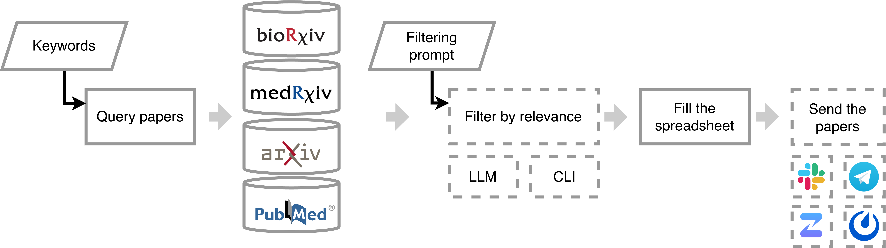

<div align="center">
  

# PaperBee_ja

**科学論文の自動検索・日本語要約・チャット通知ツール**

[](https://www.python.org/)
[](LICENSE)
[](https://github.com/theislab/paperbee)

</div>

---

PaperBee_jaは、[theislab/paperbee](https://github.com/theislab/paperbee) をベースに、LLMによる **日本語翻訳・要約パイプライン** を追加したフォーク版です。PubMed・arXiv・bioRxivから論文を自動検索し、フィルタリング・翻訳した結果をSlackなどのチャットツールに投稿します。

## 目次

- [主な機能](#主な機能)
- [処理フロー](#処理フロー)
- [対応プラットフォーム](#対応プラットフォーム)
- [インストール](#インストール)
- [セットアップ](#セットアップ)
  - [1. NCBI API Key（必須）](#1-ncbi-api-key必須)
  - [2. Slack（必須）](#2-slack必須)
  - [3. LLM連携（推奨）](#3-llm連携推奨)
- [設定ファイル](#設定ファイル)
- [使い方](#使い方)
- [Tips](#tips)
- [プロジェクト構成](#プロジェクト構成)
- [開発](#開発)
- [Reference](#reference)
- [License](#license)

## 主な機能

| 機能 | 説明 |
|------|------|
| 論文検索 | PubMed / arXiv / bioRxiv からキーワードベースで自動検索 |
| LLMフィルタリング | OpenAI / Gemini / Ollama によるカスタムプロンプトでの関連度判定 |
| 日本語翻訳 | アブストラクトを日本語に自動翻訳（PLaMo-2などの翻訳特化モデルに対応） |
| 要約生成 | LLMによる要約（翻訳と組み合わせて柔軟にパイプラインを構成可能） |
| チャット通知 | Slack / Telegram / Zulip / Mattermost への自動投稿 |
| 重複排除 | ローカルCSV / Google Sheetsで投稿済み論文を管理 |

## 処理フロー



```
キーワード検索 → 論文取得 → LLMフィルタリング → 要約 → 翻訳 → Slackへ投稿
  (PubMed等)     (findpapers)    (任意)       (Step 1)  (Step 2)   (日本語対応)
```

**要約・翻訳パイプラインは3つの組み合わせで運用できます：**

| モード | Step 1（要約） | Step 2（翻訳） | 出力例 |
|--------|:-:|:-:|------|
| 要約 + 翻訳（推奨） | ON | ON | 英語で要約 → 日本語に翻訳 |
| 翻訳のみ | OFF | ON | アブストラクト全文を日本語化 |
| 要約のみ | ON | OFF | 英語の箇条書き要約 |

## 対応プラットフォーム

| プラットフォーム | 通知 | 日本語要約 |
|:---:|:---:|:---:|
| Slack | OK | OK |
| Telegram | OK | - |
| Zulip | OK | - |
| Mattermost | OK | - |

> **Note:** 日本語要約の表示は現在Slackのみ対応しています。

## インストール

```bash
git clone https://github.com/TaichiHIBI/paperbee_ja.git
cd paperbee_ja

# 仮想環境を推奨（Python 3.10以上、3.12推奨）
pip install .
```

## セットアップ

### 1. NCBI API Key（必須）

1. [NCBI API Keys](https://www.ncbi.nlm.nih.gov/datasets/docs/v2/api/api-keys/) からAPI Keyを取得
2. `config.yml` の `NCBI_API_KEY` に設定

### 2. Slack（必須）

1. [Slack App](https://api.slack.com/apps/new) を「From an app manifest」で作成
2. ワークスペースを選択し、`manifest.json` の内容を貼り付けて作成
3. 「Install App」からワークスペースにインストール
   - 「Bot Token Scope」の追加が必要な場合は「OAuth & Permissions」→「Scopes」から追加
4. 以下のトークンを `config.yml` に設定：

| 設定項目 | 取得場所 |
|----------|----------|
| `bot_token` | OAuth & Permissions → Bot User OAuth Token |
| `app_token` | Basic Information → App-Level Tokens（`connections:write` スコープ） |
| `channel_id` | 投稿先チャンネルのID |

### 3. LLM連携（推奨）

フィルタリング・要約・翻訳にLLMを使用します。以下のいずれかを設定してください。

<details>
<summary><b>Ollama（ローカル実行）</b></summary>

[Ollama](https://github.com/ollama/ollama) をインストールし、モデルをダウンロードします。

```bash
# 翻訳特化モデル（PLaMo-2）
ollama pull mitmul/plamo-2-translate:Q8_0

# 要約・フィルタリング用モデル
ollama pull gpt-oss:20b
```

config.yml での設定例：
```yaml
LLM_PROVIDER: "ollama"
LANGUAGE_MODEL: "gpt-oss:20b"
TRANSLATION_PROVIDER: "ollama"
TRANSLATION_MODEL: "mitmul/plamo-2-translate"
```

</details>

<details>
<summary><b>OpenAI API</b></summary>

1. [OpenAI API Keys](https://platform.openai.com/settings/organization/api-keys) からAPI Keyを取得
2. config.yml に設定：

```yaml
LLM_PROVIDER: "openai"
LANGUAGE_MODEL: "gpt-4o-mini"
LLM_API_KEY: "sk-..."

TRANSLATION_PROVIDER: "openai"
TRANSLATION_MODEL: "gpt-4o-mini"
TRANSLATION_API_KEY: "sk-..."
```

</details>

<details>
<summary><b>Google Gemini API</b></summary>

1. [Google AI Studio](https://ai.google.dev/aistudio?hl=ja) からAPI Keyを取得
2. config.yml に設定：

```yaml
LLM_PROVIDER: "gemini"
LANGUAGE_MODEL: "gemini-2.0-flash"
LLM_API_KEY: "..."

TRANSLATION_PROVIDER: "gemini"
TRANSLATION_MODEL: "gemini-2.0-flash"
TRANSLATION_API_KEY: "..."
```

</details>

## 設定ファイル

すべての設定はYAMLファイルで管理します。テンプレートは [`files/config_template.yml`](files/config_template.yml) を参照してください。

```bash
cp files/config_template.yml files/config.yml
# config.yml を編集して API Key やクエリを設定
```

### 設定項目の概要

```yaml
# --- 履歴管理 ---
HISTORY_FILE: "history.csv"              # ローカルCSVで重複排除（推奨）
LOCAL_ROOT_DIR: "../paperbee_ja/files"

# --- 検索クエリ ---
NCBI_API_KEY: "your-ncbi-api-key"
query_biorxiv: "[keyword1] OR [keyword2]"
query_pubmed_arxiv: "([keyword]) AND ([AI] OR [machine learning])"

# --- LLMフィルタリング（任意） ---
LLM_FILTERING: false
LLM_PROVIDER: "ollama"                   # "ollama" | "openai" | "gemini"
LANGUAGE_MODEL: "gemma2"
LLM_API_KEY: ""

# --- Step 1: 要約（任意） ---
SUMMARIZATION_ENABLED: false
SUMMARIZATION_PROVIDER: "ollama"
SUMMARIZATION_MODEL: "gemma2"
SUMMARIZATION_API_KEY: ""

# --- Step 2: 翻訳（任意） ---
TRANSLATION_ENABLED: false
TRANSLATION_PROVIDER: "ollama"
TRANSLATION_MODEL: "mitmul/plamo-2-translate"
TRANSLATION_API_KEY: ""

# --- Slack ---
SLACK:
  is_posting_on: true
  bot_token: "xoxb-..."
  channel_id: "C..."
  app_token: "xapp-..."
```

> **Tip:** `config_yourfocus.yml` のように複数の設定ファイルを作成すれば、分野ごとに異なる検索を実行できます。その場合は `HISTORY_FILE` のファイル名もそれぞれ変更してください。

> クエリの書き方やフィルタリングプロンプトの詳細は [フォーク元のドキュメント](https://github.com/theislab/paperbee) を参照してください。

## 使い方

### 基本コマンド

```bash
paperbee post --config /path/to/config.yml --since 1 --databases pubmed biorxiv
```

| オプション | 説明 | デフォルト |
|-----------|------|-----------|
| `--config` | 設定ファイルのパス | （必須） |
| `--since` | 何日前まで遡って検索するか | `1` |
| `--databases` | 検索対象（`pubmed` `biorxiv` `arxiv`） | 全データベース |
| `--interactive` | 手動フィルタリングモード | OFF |

### 実行例

```bash
# 過去1日分の論文を検索・投稿
paperbee post --config files/config.yml

# 過去3日分、PubMedとbioRxivのみ
paperbee post --config files/config.yml --since 3 --databases pubmed biorxiv

# 手動で論文を選別
paperbee post --config files/config.yml --interactive
```

### 定期実行（cron）

毎日午前9時に自動実行する場合：

```bash
# crontab -e で以下を追加
0 9 * * * /path/to/venv/bin/paperbee post --config /path/to/config.yml --since 1 --databases pubmed biorxiv
```

## Tips

- **クラウド同期** — `files/` ディレクトリをGoogle DriveやDropboxなどにマウントしておくと、設定・検索履歴を複数デバイスで共有できます。
- **定期実行** — cronで自動化する場合は、常時稼働するサーバーか、スリープしない設定のデバイスで実行してください。
- **翻訳品質** — 翻訳ステップには PLaMo-2 などの翻訳特化モデルを使うと、より自然な日本語が得られます。
- **フィルタリング精度** — `FILTERING_PROMPT` の設計が結果の質に大きく影響します。具体的な採択/除外基準を明記してください。

## プロジェクト構成

```
paperbee_ja/
├── src/PaperBee/
│   ├── daily_posting.py                  # CLIエントリーポイント
│   └── papers/
│       ├── papers_finder.py              # 検索・処理のオーケストレーション
│       ├── utils.py                      # 翻訳・要約・DOI取得
│       ├── llm_filtering.py              # LLMフィルタリング
│       ├── slack_papers_formatter.py     # Slack投稿フォーマッタ
│       ├── telegram_papers_formatter.py  # Telegram投稿フォーマッタ
│       ├── zulip_papers_formatter.py     # Zulip投稿フォーマッタ
│       ├── mattermost_papers_formatter.py # Mattermost投稿フォーマッタ
│       ├── google_sheet.py               # Google Sheets連携
│       ├── validate_inputs.py            # 設定バリデーション
│       └── cli.py                        # 対話型フィルタリング
├── tests/                                # テストスイート
├── files/
│   └── config_template.yml               # 設定ファイルテンプレート
├── images/                               # ロゴ・パイプライン図
├── manifest.json                         # Slack Appマニフェスト
├── pyproject.toml                        # パッケージ定義・依存関係
└── Makefile                              # 開発タスク
```

### フォーク元からの主な変更箇所

| ファイル | 変更内容 |
|----------|----------|
| `papers/utils.py` | 翻訳・要約機能（`translate_abstract`）を追加 |
| `papers/slack_papers_formatter.py` | 日本語要約の表示に対応 |
| `daily_posting.py` | 翻訳オプションの読み込みに対応 |
| `papers/papers_finder.py` | 翻訳フロー・ローカル履歴管理を統合 |
| `papers/llm_filtering.py` | Geminiプロバイダを追加 |

## 開発

```bash
# 開発環境セットアップ
make install

# テスト実行
make test

# リント・型チェック
make check

# ドキュメントビルド
make docs
```

## Reference

Original PaperBee:

```bibtex
@misc{paperbee_2025,
  author  = {Lucarelli, Daniele and Shitov, Vladimir A. and Saur, Dieter and Zappia, Luke and Theis, Fabian J.},
  title   = {PaperBee: An Automated Daily Digest Bot for Scientific Literature Monitoring},
  year    = {2025},
  url     = {https://github.com/theislab/paperbee},
  note    = {Version 1.2.0}
}
```

## License

[MIT License](LICENSE)
