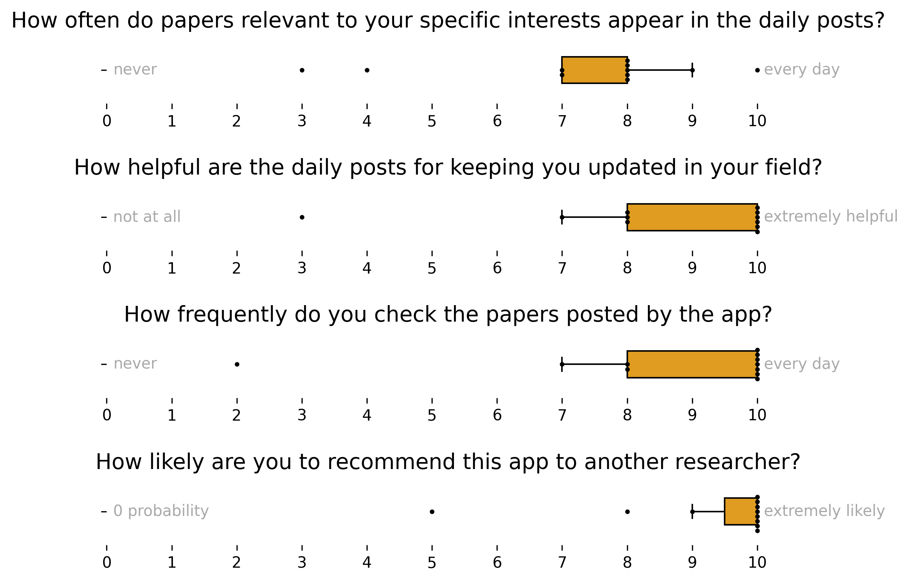

# Summary

The number of scientific publications grows exponentially with an estimated average rate of 4% per year and a doubling time of 17.3 years [@Bornmann2021]. In particularly popular fields, such as machine learning or single-cell transcriptomics, it can be even faster, with a doubling time of 23 months for papers [@Krenn2023] and 15 months for new authors [@Svensson2020]. Staying current with the ever-expanding body of scientific literature is increasingly a challenge for individual researchers and research laboratories. We developed **PaperBee**, a lightweight, modular, and open-source Python package designed to stay updated with new scientific papers. It automatically retrieves new publications every day, filters them based on the research interests of a particular user or team, and posts the selected publications to messenger applications commonly used in team settings. By integrating structured keyword-based queries, access to preprint databases and PubMed via the `findpapers` package [@grosman2020], and filtering powered by large language models (LLMs), **PaperBee** discovers relevant papers with minimal or no manual effort. We support Slack, Zulip, and Telegram as channels for posting, and keep a structured archive of found papers in Google Sheets. **PaperBee** adapts to both interactive and fully automated use cases, enabling individual researchers, labs, and institutions to stay up-to-date with cutting-edge developments across multiple domains.

# Statement of Need

The scientific publication landscape is growing at an unprecedented pace, often leaving researchers overwhelmed by the sheer volume of new literature. Conventional alert mechanisms, such as email subscriptions or RSS feeds [@hokamp2004], are limited in scope and flexibility, and often fail to integrate with modern collaborative tools. Additionally, they are limited to filtering by keywords, which can be noisy or incomplete, leading to low signal-to-noise ratios in alerts. Prior tools with automation capabilities, such as ASReview [@vandeschoot2021], are designed for writing systematic reviews rather than daily monitoring of current literature. **PaperBee** fills this gap by offering an open, transparent, and configurable tool tailored for continuous literature monitoring. It bridges automation and collaboration, offering programmable integration with chat platforms and shared spreadsheets, and optional LLM-based semantic filtering that helps select only the most relevant content.

# Functionality

PaperBee provides the following features for literature monitoring (Figure 1):

* **Paper Retrieval**: Uses the `findpapers` package [@grosman2020] to access PubMed, arXiv, medRxiv, and bioRxiv through structured keyword queries. Papers are retrieved based on the list of keywords, a familiar format to researchers from querying databases for literature review;
* **Filtering**:
  * Manual command-line interface (CLI) for hands-on review and selection of papers
  * Automated relevance filtering using LLMs (OpenAI GPT [@openai2024gpt4o] or open-source alternatives via Ollama [@ollama2023]), customizable with domain-specific prompts
* **Multichannel Delivery**: Posts curated papers to Slack, Telegram, or Zulip;
* **Archiving**: Automatically logs selected papers into Google Sheets for tracking and to avoid sending the same paper twice;
* **Configurability**: a setup requires filling out a simple YAML file. Keywords for queries, filtering prompt for an LLM, and API keys for databases and messaging applications must be filled.

The modular nature of **PaperBee** enables extensibility and interoperability, making it straightforward for users to set up data sources, filters, or output channels, and for developers to add new functionalities.

# Deployment 

On GitHub, we provide comprehensive instructions for setting up **PaperBee**[@paperbee_github], which have been successfully tested by independent users in different laboratories. Briefly, users need to:

1. Set up a search query. This is identical to a query researchers normally use for finding papers using tools such as Google Scholar. We recommend making it broad and including synonyms to avoid missing relevant papers, and splitting keywords into two parts: domain-based and methods-based. Here is an example query for a user interested in computational analysis of image-based cell profiling:

`([image-based cell profiling] OR [cell imaging] OR [cell morphology] OR [phenotypic profiling] OR [high-content screening] OR [microscopy] OR [fluorescence imaging] OR [cellular phenotyping] OR [image analysis]) AND ([machine learning] OR [deep learning] OR [neural networks] OR [computer vision] OR [image segmentation] OR [feature extraction] OR [pattern recognition] OR [bioinformatics] OR [computational biology])`

The bioRxiv API has stricter requirements for the query (see the documentation of `findpapers` [@grosman2020] for the detailed description). Briefly, it does not allow nested parentheses, "AND" statements between groups of keywords, and "NOT" terms. To overcome this, a user must set up a different query for this database. For the user above, this query is as follows:

`[image-based cell profiling] OR [cell imaging] OR [cell morphology] OR [phenotypic profiling] OR [high-content screening] OR [microscopy] OR [fluorescence imaging] OR [cellular phenotyping] OR [image analysis] OR [neural networks] OR [computer vision] OR [image segmentation] OR [feature extraction] OR [pattern recognition]`

Note that it is recommended to remove broad keywords such as "machine learning" or "bioinformatics" from this query to avoid querying all the papers with this keyword published on a particular day.

2. Set up a filtering prompt. This is the description of the team's research interests provided to an LLM to select relevant papers. Here is an example for the query above:

`You are a lab manager at a research lab focusing on the AI for image-based cell profiling. You are reviewing a list of research papers to determine if they are relevant to your lab. Please answer 'yes' or 'no' to the following question: Is the following research paper relevant?`

In cases of more specific interests, the filtering prompt can be further extended to focus on more relevant papers.

3. Set up the messaging platforms and API keys required for **PaperBee** to function. We provide detailed instructions and templates on GitHub [@paperbee_github]. Briefly, the following information is required:
* Google Sheets document with a particular structure
* Google Service Account integrated with the Google Sheet
* NCBI API key to query papers on PubMed
* Setup of posting channels and corresponding API keys
* OpenAI API key or a preferred model for Ollama

The package contains unit and integration tests to make sure that the setup works correctly. After completing the configuration file in YAML format, teams can run a Python script that performs a daily search of new publications. Experienced users can also leverage PaperBee's modular structure to build custom functionality with its components. The code is openly accessible on GitHub under the MIT license.

# User experience

We ran **PaperBee** for over a year in a laboratory focusing on computational methods development for single-cell transcriptomics. To get insights on whether it helps laboratory members in their work, we conducted a survey (Figure 2) asking researchers to rate how useful daily posts are for being updated in the field, how frequently they check messages from **PaperBee**, how often relevant papers are found and how likely would users recommend **PaperBee** to other researchers teams. Among 11 responses, we see overall highly positive feedback, with the highest score given by most of the responders for 3 out of 4 questions, suggesting that **PaperBee** greatly benefits researchers. The only question where the majority of responders did not give the highest grade was on the relevance of found papers to the specific interest of a researcher. Given the number of papers published in the field, the broadness of the interests in the laboratory, and the overall positive scores, we believe this is an expected result, and not a flaw of **PaperBee**. 

# Outlook

Here, we present **PaperBee**, a modular open-source Python application for daily search of new scientific publications. **PaperBee** requires minimal programming experience from users and is comprehensively documented for easy setup. Developers can easily extend the code due to a modular architecture, extensive documentation, and automated testing. **PaperBee** can be used in laboratories worldwide for daily paper searches and has successfully demonstrated its usefulness in a laboratory developing computational methods for single-cell transcriptomics. While PaperBee is designed to keep researchers updated with new literature, it can also be used for broader literature searches. We envision that **PaperBee** will greatly benefit the scientific community by enabling daily discovery of more relevant publications and better integration with team communication tools.

# Acknowledgements

We thank the creators and maintainers of the `findpapers` package [@grosman2020], and the maintainers of the PubMed, arXiv, and bioRxiv APIs. We also acknowledge OpenAI and Ollama for their LLM contributions. Special thanks to Ciro Ramírez-Suástegui and Daniel Strobl for testing the installation. V.A.S. is supported by the Helmholtz Association under the MUDS program. D.L. is supported by the German Cancer Consortium (DKTK), Deutsche Krebshilfe (DKH #70115743) and Deutsche Forschungsgemeinschaft (DFG SA 1374/8-1, Project-ID 515991405; DFG SA 1374/7-1, Project-ID 515571394; DFG SA 1374/6-1, Project ID 458890590) to D.S..

# Competing Interests
F.J.T. consults for Immunai Inc., CytoReason Ltd, Cellarity, BioTuring Inc., and Genbio.AI Inc., and has an ownership interest in Dermagnostix GmbH and Cellarity.

# References
