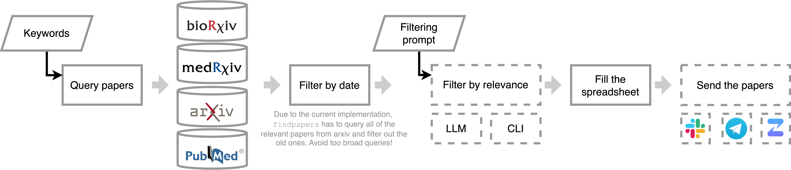

# Summary

The number of scientific publications grows exponentially with an average rate estimated around 4% per year and doubling time of 17.3 years [@Bornmann2021]. In particularly popular fields, such as machine learning or single-cell transcriptomics it can be even faster, reaching doubling time of 23 months for papers [@Krenn2023] and 15 months for new authors [@Svensson2020] correspondingly. Staying current with the ever-expanding body of scientific literature is an increasing challenge for researchers. We developed **Papersbee**, a lightweight, modular, and open-source Python package designed to stay updated with new scientific papers. It automacally finds new publications every day, filters them based on research interest of a particular user or a team, and sends the selected publication to the messenger applications commonly used for a team work. By integrating structured keyword-based queries, access to preprint databases and PubMed via the `findpapers` package [@grosman2020], and filtering powered by large language models (LLMs), Papersbee discovers relevant papers with minimal or no manual effort. We support team Slack, Zulip and Telegram as channels for publication, and keep a structured archive of found papers in Google Sheets. Papersbee adapts to both interactive and fully automated use cases, enabling individual researchers, labs, and institutions to keep updated of cutting-edge developments across multiple domains.

# Statement of Need

The scientific publication landscape is growing at an unprecedented pace, often leaving researchers overwhelmed by the sheer volume of new literature. Conventional alert mechanisms, such as email subscriptions or RSS feeds [@hokamp2004], are limited in scope and flexibility, and fail to integrate with modern collaborative tools. Moreover, they often lack intelligent filtering, leading to low signal-to-noise ratios in alerts. Prior tools with automation capabilities, such as ASReview [@vandeschoot2021], have emphasized systematic review workflows rather than daily monitoring. **Papersbee** fills this gap by offering an open, transparent, and configurable tool tailored for continuous literature monitoring. It bridges automation and collaboration, offering programmable integration with chat platforms and shared spreadsheets, and optional LLM-based semantic filtering that helps selecting only the most relevant content.

# Functionality

Papersbee provides the following set of features for literature monitoring (Figure 1):
* **Daily Retrieval**: Uses the `findpapers` package [@grosman2020] to access PubMed, arXiv, and bioRxiv through structured keyword queries.
* **Filtering**:
  * Manual Command-line interface (CLI) interface for hands-on review and selection if this is desired.
  * Automated relevance filtering using LLMs (OpenAI GPT or open-source alternatives via Ollama) [@openai2024gpt4o; @ollama2023], customizable with domain-specific prompts.
* **Multichannel Delivery**: Posts curated papers to Slack, Telegram, and Zulip.
* **Archival**: Automatically logs daily selected papers into Google Sheets for tracking and avoiding sending the same paper twice.
* **Configurability**:
  * Keywords-based papers search, familiar to researchers from querying databases for literature review.
  * Filtering by LLMs based on a simple natural language description of the research interests of a team or individual researchers.
  * Simple YAML-based configuration with a template for easy setup.

# Implementation

Papersbee adopts a modular architecture that separates core responsibilities into pluggable components: query handling, paper retrieval, filtering, formatting, and publishing. Queries are managed as YAML files and passed to the `findpapers` engine, which searches scientific databases via correspondent Application Programming Interfaces (APIs). The retrieved articles undergo a two-stage filtering process—initially via CLI or fully automated LLM classification—based on user-defined prompts [@dennstaedt2024; @cai2025]. Filtered results are formatted into platform-specific message payloads and sent to designated messengers via their respective APIs. A centralized Google Sheet is used for cumulative archival and collaborative review. This design supports extensibility and interoperability, making it straightforward to plug in new data sources, filters, or output channels.

# Deployment 

On GitHub, we provide comprehensive instructions for setting up the Papersbee [@papersbee_github], which were successfully tested by independent users in different laboratories. Briefly, users must:
1. Set up a search query. This is identical to a query researchers normally use for finding papers for a literature review. We recommend making broader and including synonyms to not miss relevant papers, and splitting keywords into two parts: domain-based and methods-based. Here is an example query for a user interested in image-based cell profiling:

`([image-based cell profiling] OR [cell imaging] OR [cell morphology] OR [phenotypic profiling] OR [high-content screening] OR [microscopy] OR [fluorescence imaging] OR [cellular phenotyping] OR [image analysis]) AND ([machine learning] OR [deep learning] OR [neural networks] OR [computer vision] OR [image segmentation] OR [feature extraction] OR [pattern recognition] OR [bioinformatics] OR [computational biology])`

The bioRxiv API has stricter requirements for the query (see the documentation of `findpapers` [@grosman2020] for the detailed description). Briefly, it does not allow nested parentheses, "AND" statements between groups of keywords, and "NOT" terms. To overcome this, we set up a different query for this database. For the user above, this query looks like this:

`[image-based cell profiling] OR [cell imaging] OR [cell morphology] OR [phenotypic profiling] OR [high-content screening] OR [microscopy] OR [fluorescence imaging] OR [cellular phenotyping] OR [image analysis] OR [neural networks] OR [computer vision] OR [image segmentation] OR [feature extraction] OR [pattern recognition]`

Note that we deleted too broad keywords such as "machine learning" or "bioonformatics" to not query all the papers with this keyword published on a particular day.

2. Set up a filtering prompt. This is the description of research interests in a natural language. Here is an example for the above-mentioned user:

`You are a lab manager at a research lab focusing on the ai for image-based cell profiling. You are reviewing a list of research papers to determine if they are relevant to your lab. Please answer 'yes' or 'no' to the following question: Is the following research paper relevant?`

We recommend changing the middle part of the prompt to better select publications relevant for the laboratory. A more complicated example used by a team focusing on single-cell transcriptomics methods development and application looks as following:

`You are a lab manager at a research lab focusing on single-cell RNA sequencing, spatial transcriptomics, machine learning applications and methods development in computational biology. Lab research focuses on fibrosis, VEO-IBD, lung health, COPD, and translational applications of single-cell data. Lab members are interested in building single-cell atlases, working with single-cell data on the level of patients (donors, individuals) and keeping updated on the most recent methods in single-cell biology. Another focus of the lab is benchmarking single-cell analysis tools. A specific area of interest is single-cell data integration. You are reviewing a list of research papers to determine if they are relevant to your lab. Please answer 'yes' or 'no' to the following question: Is the following research paper relevant?`

3. Set up the messengers and API keys required for the Papersbee to function. We provide detailed instructions and templates on the Github [@papersbee_github]. Briefly, the following parts are required:
* Google Sheets document with a particular structure
* Google Service Account integrated to the Google Sheets
* NCBI API key to make requests to NCBI for querying papers on PubMed and obtaining their DOIs
* Posting channels setup
* OpenAI API key or a preferred model for Ollama 

The package contains unit and integration tests to make sure that the setup works correctly. After filling out the configuration file in YAML format, users do not have to run any code and can simply run a python script performing daily search of new publications. An experienced user, however, can leverage modular structure of PapersBee to build custom functionality with its components. The code is openly accessible on GitHub under the MIT license.

# Acknowledgements

We gratefully acknowledge the creators and maintainers of the `findpapers` library [@grosman2020], whose work forms the backbone of Papersbee's retrieval functionality. We also thank the teams behind the PubMed, arXiv, and bioRxiv APIs, which make programmatic literature access possible. We acknowledge the developers and researchers behind OpenAI and Ollama for the LLMs used in Papersbee's semantic filtering experiments. finally, we would like to thank Ciro Ramírez-Suástegui from The Wellcome Sanger Institute and Daniel Strobl from Helmholtz Munich for testing the installation of Papersbee. V. A. S. is supported by the Helmholtz Association under the joint research school "Munich School for Data Science - MUDS".

# References
